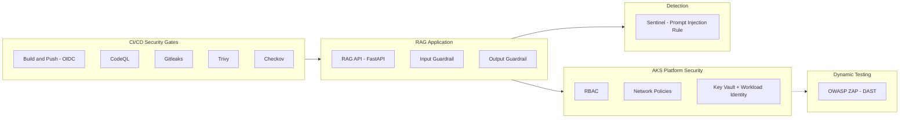

# AI Application Security & DevSecOps Pipeline

## Executive Summary

This project demonstrates how to take an AI-enabled application from threat model to running, defended code on Azure. It builds and secures a RAG-based customer service assistant — the same system a companion governance program deliberately scoped as *design only, not running code*. This program closes that gap: a real FastAPI service, real input/output guardrails, a security-gated CI/CD pipeline covering both static and dynamic testing, AKS workload hardening, and a detection rule built against the application's own logs — deployed to live Azure infrastructure, not just designed on paper.

Where the companion AI governance program answers *"what controls should exist around this AI system?"*, this program answers *"how do you build and ship the thing those controls protect — securely, with evidence at every layer?"*

---

## Architecture at a glance

A simplified view — see [`docs/architecture-overview.md`](./docs/architecture-overview.md) for the full diagram with trust boundaries and data flows.

---

## Suggested reading order

1. [`docs/architecture-overview.md`](./docs/architecture-overview.md) — system design, trust boundaries, scope boundaries
2. [`docs/threat-model-rag-service.md`](./docs/threat-model-rag-service.md) — STRIDE + OWASP LLM Top 10 (2025) threat modelling
3. [`docs/framework-mapping.md`](./docs/framework-mapping.md) — control mapping to Azure CAF
4. [`app/`](./app/) — guardrail code, tests, and a real dependency-CVE resolution; read the "Issues encountered" sections for what actually broke and how it was fixed
5. [`kubernetes/`](./kubernetes/) and [`terraform/`](./terraform/) — workload hardening and infrastructure, including a real CrashLoopBackOff and a real Checkov triage of 16 findings
6. [`.github/workflows/`](./.github/workflows/) — CI/CD security gates; note that the four static gates run automatically while `zap-scan.yml` is manually triggered by design
7. [`sentinel/`](./sentinel/) — detection rule built against real application logs

---

## Key Outcomes

| Capability | Value | Evidence |
|---|---|---|
| AI Threat Model | 1 (STRIDE + OWASP LLM Top 10:2025) | [`docs/threat-model-rag-service.md`](./docs/threat-model-rag-service.md) |
| Guardrails Implemented | 2 (input + output), 17 passing tests, 1 documented known bypass | [`app/`](./app/) |
| CI/CD Security Gates | 6 — build-and-push (OIDC), CodeQL, Gitleaks, Trivy, Checkov, OWASP ZAP | [`.github/workflows/`](./.github/workflows/) |
| Real CVEs Found and Resolved | 3 HIGH (`starlette`, via a `fastapi` upgrade) | [`app/README.md`](./app/README.md) |
| Real IaC Findings Triaged | 36 total Checkov checks — 13 passed, 0 failed, 23 skipped with written justification per check | [`terraform/README.md`](./terraform/README.md) |
| Kubernetes Security Controls | RBAC, NetworkPolicy (default-deny), restricted Pod Security Standards, Workload Identity | [`kubernetes/`](./kubernetes/) |
| Sentinel Detection Rules | 1, schema-verified against real `ContainerLogV2` | [`sentinel/`](./sentinel/) |
| Framework Mapped | Azure CAF (Secure, Govern, Manage, Adopt) | [`docs/framework-mapping.md`](./docs/framework-mapping.md) |

---

## Evidence

### Application Security
- [`app/`](./app/) — guardrail code, test suite, and dependency-CVE resolution writeup

### AKS Deployment
- [`kubernetes/`](./kubernetes/), [`terraform/`](./terraform/)
- [`screenshots/aks-deployment/`](./screenshots/aks-deployment/) — image push, pod status, a real crash and its fix, and live end-to-end guardrail testing against the deployed service

### CI/CD Pipeline
- [`.github/workflows/`](./.github/workflows/)
- [`screenshots/cicd-pipeline/`](./screenshots/cicd-pipeline/) — OIDC-authenticated build/push, registry tagging, and real Trivy CVE findings through to resolution

### Detection Engineering
- [`sentinel/`](./sentinel/)

---

## Overview

This project models the build of a single AI-powered service for **Contoso Retail Group**: a customer-facing RAG assistant that answers product, order status, and policy questions by retrieving from a document store and generating a response via Azure OpenAI.

Full system detail is in [`docs/architecture-overview.md`](./docs/architecture-overview.md).

---

## What's actually live vs. reference design

| Component | Status |
|---|---|
| RAG API service, both guardrails | **Live** — deployed to AKS, full request flow confirmed end-to-end including a real blocked prompt injection attempt |
| AKS, ACR, Key Vault, Workload Identity (app + CI/CD) | **Live** — provisioned via Terraform, confirmed via direct `az` queries |
| CI/CD: build-and-push, CodeQL, Gitleaks, Checkov, Trivy | **Live** — all five have run successfully against real code; Trivy and Checkov each went through a full real-findings triage, not just a pass/fail check |
| AKS Container Insights → Log Analytics | **Live, wiring confirmed** — reuses the companion governance repo's Sentinel-onboarded workspace rather than a redundant one. Data-flow query not yet separately confirmed — see [`sentinel/README.md`](./sentinel/README.md) |
| OWASP ZAP (DAST) | **Reference design** — workflow written and validated, not yet run against a live reachable endpoint |
| Real Azure OpenAI / Azure AI Search | **Out of scope by design** — mock mode only; see [`docs/architecture-overview.md`](./docs/architecture-overview.md) |
| Checkov (IaC Scan) | **Live, clean** — 13 passed, 0 failed, 23 skipped. Every skip carries an inline `#checkov:skip` comment with a specific reason (Premium-SKU-gated ACR feature, architecture tradeoff, or deferred future work) — none are blanket suppressions. See `terraform/README.md`'s "Issues encountered" section for the individual reasoning. |

---

## Repository structure

| Folder | Contents |
|---|---|
| [`docs/`](./docs/) | Architecture overview, threat model, framework mapping |
| [`app/`](./app/) | RAG API service, input/output guardrails, tests |
| [`kubernetes/`](./kubernetes/) | Deployment, RBAC, NetworkPolicy, Pod Security Standards |
| [`terraform/`](./terraform/) | IaC for AKS, ACR, Key Vault, app + CI/CD Workload Identity |
| [`.github/workflows/`](./.github/workflows/) | Build/push (OIDC) + CodeQL, Gitleaks, Trivy, Checkov, OWASP ZAP |
| [`sentinel/`](./sentinel/) | KQL detection rule for prompt injection |
| [`screenshots/`](./screenshots/) | `aks-deployment/` and `cicd-pipeline/` evidence |

---

## Tooling

- **Python / FastAPI** — RAG API service
- **Azure Kubernetes Service (AKS)** — hosting, with Azure Policy add-on and automatic patch upgrades enabled
- **Azure Key Vault, Workload Identity Federation** — secrets management, used for both the running application and GitHub Actions CI/CD via two separate, least-privilege identities
- **GitHub Actions** — CI/CD, authenticating to Azure via OIDC with no stored credentials
- **OWASP ZAP** — dynamic application security testing (DAST)
- **Terraform** — infrastructure as code
- **Microsoft Sentinel** — detection engineering, reusing an existing Sentinel-onboarded workspace

---

## Frameworks referenced

- [OWASP Top 10 for LLM Applications (2025)](https://owasp.org/www-project-top-10-for-large-language-model-applications/)
- [OWASP Top 10 (Web Application)](https://owasp.org/www-project-top-ten/)
- [Microsoft Azure Cloud Adoption Framework (CAF)](https://learn.microsoft.com/azure/cloud-adoption-framework/)

See [`docs/framework-mapping.md`](./docs/framework-mapping.md) for control-level detail.

---

## Related work

Third in a connected series of three programs:

- [`erp-identity-security-reference-architecture`](https://github.com/jonarm/erp-identity-security-reference-architecture) — Zero Trust identity security for a Dynamics 365 ERP
- [`ai-security-llm-governance-controls`](https://github.com/jonarm/ai-security-llm-governance-controls) — AI governance and policy for Contoso Retail Group; this program builds the RAG assistant that repo scopes as design-only, and reuses its Sentinel-onboarded Log Analytics workspace