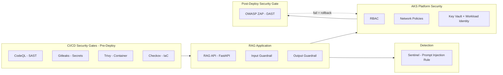

# AI Application Security & DevSecOps Pipeline

## Executive Summary

This project demonstrates how to take an AI-enabled application from threat model to
running, defended code. It builds and secures a RAG-based customer service assistant —
the same system that a companion governance program deliberately scoped as *design only,
not running code*. This program closes that gap: a real FastAPI service, real input/output
guardrails, a security-gated CI/CD pipeline covering both static and dynamic testing, AKS
workload hardening, and a detection rule built against the application's own logs.

Where the companion AI governance program answers *"what controls should exist around
this AI system?"*, this program answers *"how do you build and ship the thing those
controls protect — securely, with evidence at every layer?"*

---

## Architecture at a glance

A simplified view — see [`docs/architecture-overview.md`](./docs/architecture-overview.md)
for the full diagram with trust boundaries and data flows.

---

## Suggested reading order

1. [`docs/architecture-overview.md`](./docs/architecture-overview.md) — system design, trust boundaries, scope boundaries
2. [`docs/threat-model-rag-service.md`](./docs/threat-model-rag-service.md) — STRIDE + OWASP LLM Top 10 threat modelling
3. [`docs/framework-mapping.md`](./docs/framework-mapping.md) — control mapping to Azure CAF
4. [`app/`](./app/) — guardrail code and test cases; read deployment notes for what each guardrail does and does not catch
5. [`kubernetes/`](./kubernetes/) and [`terraform/`](./terraform/) — workload hardening and infrastructure
6. [`.github/workflows/`](./.github/workflows/) — CI/CD security gates; note that CodeQL/Gitleaks/Trivy/Checkov run pre-deploy on code and config, while `zap-scan.yml` runs post-deploy against a live staging endpoint — read for findings actually caught during the build
7. [`sentinel/`](./sentinel/) — detection rule built against real application logs

---

## Key Outcomes

<!-- TBD — update with real numbers as each component is built -->

| Capability | Value | Evidence |
|---|---|---|
| AI Threat Model | 1 (STRIDE + OWASP LLM Top 10) | [`docs/threat-model-rag-service.md`](./docs/threat-model-rag-service.md) |
| Guardrails Implemented | TBD (input + output) | [`app/`](./app/) |
| CI/CD Security Gates | 5 (CodeQL, Gitleaks, Trivy, Checkov, OWASP ZAP) | [`.github/workflows/`](./.github/workflows/) |
| Kubernetes Security Controls | TBD | [`kubernetes/`](./kubernetes/) |
| Terraform IaC Coverage | TBD | [`terraform/`](./terraform/) |
| Sentinel Detection Rules | TBD | [`sentinel/`](./sentinel/) |
| Framework Mapped | Azure CAF | [`docs/framework-mapping.md`](./docs/framework-mapping.md) |

---

## Evidence

<!-- TBD — link screenshots/ subfolders as each piece is deployed -->

### Application Security
- [`app/`](./app/) — guardrail code and test cases

### CI/CD Pipeline — Static Gates (Pre-Deploy)
- [`.github/workflows/`](./.github/workflows/) — CodeQL, Gitleaks, Trivy, Checkov
- [`screenshots/github-actions-pipeline/`](./screenshots/github-actions-pipeline/)

### CI/CD Pipeline — Dynamic Gate (Post-Deploy)
- [`.github/workflows/zap-scan.yml`](./.github/workflows/zap-scan.yml) — OWASP ZAP baseline/full scan against staging
- [`screenshots/zap-dast-results/`](./screenshots/zap-dast-results/)

### Kubernetes & Infrastructure
- [`kubernetes/`](./kubernetes/), [`terraform/`](./terraform/)
- [`screenshots/aks-deployment/`](./screenshots/aks-deployment/)
- [`screenshots/key-vault-workload-identity/`](./screenshots/key-vault-workload-identity/)

### Detection Engineering
- [`sentinel/`](./sentinel/)
- [`screenshots/sentinel-alerts/`](./screenshots/sentinel-alerts/)

### Guardrail Testing
- [`screenshots/guardrail-test-results/`](./screenshots/guardrail-test-results/)

---

## Overview

This project models the build of a single AI-powered service for **Contoso Retail
Group**: a customer-facing RAG assistant that answers product, order status, and policy
questions by retrieving from a document store and generating a response via Azure OpenAI.

Full system detail is in [`docs/architecture-overview.md`](./docs/architecture-overview.md).

---

## What's actually live vs. what's reference design

<!-- TBD — fill in honestly as each piece is built, same standard as the other two repos -->

| Component | Status |
|---|---|
| RAG API service | TBD |
| Input guardrail (`prompt_filter.py`) | TBD |
| Output guardrail (`response_filter.py`) | TBD |
| AKS deployment, RBAC, Network Policies, Pod Security | TBD |
| Terraform (AKS, Key Vault, ACR) | TBD |
| CI/CD static gates (CodeQL, Gitleaks, Trivy, Checkov) | TBD |
| CI/CD dynamic gate (OWASP ZAP DAST against staging) | TBD — depends on a deployed staging endpoint existing; if staging isn't kept running, document as reference design with the ZAP config/workflow built but not continuously exercised |
| Sentinel prompt injection detection rule | TBD |

---

## Repository structure

| Folder | Contents |
|---|---|
| [`docs/`](./docs/) | Architecture overview, threat model, framework mapping |
| [`app/`](./app/) | RAG API service, input/output guardrails, test cases |
| [`kubernetes/`](./kubernetes/) | Deployment, RBAC, NetworkPolicy, Pod Security Standards |
| [`terraform/`](./terraform/) | IaC for AKS, Key Vault, ACR |
| [`.github/workflows/`](./.github/workflows/) | CodeQL, Gitleaks, Trivy, Checkov (pre-deploy) + OWASP ZAP (post-deploy DAST) |
| [`sentinel/`](./sentinel/) | KQL detection rule for prompt injection |
| [`screenshots/`](./screenshots/) | Evidence of deployed controls and pipeline runs |

---

## Tooling

- **Python / FastAPI** — RAG API service
- **Azure OpenAI Service, Azure AI Search** — generation and retrieval
- **Azure Kubernetes Service (AKS)** — hosting
- **Azure Key Vault, Workload Identity Federation** — secrets management
- **GitHub Actions** — CI/CD security gates
- **OWASP ZAP** — dynamic application security testing (DAST) against the deployed staging endpoint
- **Terraform** — infrastructure as code
- **Microsoft Sentinel** — detection engineering

---

## Frameworks referenced

- [OWASP Top 10 for LLM Applications](https://owasp.org/www-project-top-10-for-large-language-model-applications/)
- [OWASP Top 10 (Web Application)](https://owasp.org/www-project-top-ten/) — relevant to DAST coverage of the RAG API's HTTP surface
- [Microsoft Azure Cloud Adoption Framework (CAF)](https://learn.microsoft.com/azure/cloud-adoption-framework/)

See [`docs/framework-mapping.md`](./docs/framework-mapping.md) for control-level detail.

---

## Related work

This is the third in a connected series of three programs:

- [`erp-identity-security-reference-architecture`](https://github.com/jonarm/erp-identity-security-reference-architecture) — Zero Trust identity security for a Dynamics 365 ERP
- [`ai-security-llm-governance-controls`](https://github.com/jonarm/ai-security-llm-governance-controls) — AI governance and policy for Contoso Retail Group; this program builds the RAG assistant that repo scopes as design-only