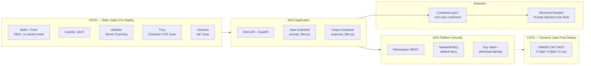

# AI Application Security & DevSecOps Pipeline

## Executive Summary

This project demonstrates how to take an AI-enabled application from threat
model to running, defended code on Azure. It builds and secures a RAG-based
customer service assistant — the same system a companion governance program
deliberately scoped as *design only, not running code*. This program closes
that gap: a real FastAPI service, real input/output guardrails with a full
test suite, a six-gate CI/CD security pipeline, AKS workload hardening, and
a detection rule confirmed firing against real application logs from the live
deployment.

Every component in this repo that claims to be "live" is backed by a
screenshot, a real deployment finding, or a confirmed query result — not just
a diagram. The few items that are reference design are documented honestly,
consistently with the evidence standard used across this three-repo series.

Where the companion AI governance program answers *"what controls should exist
around this AI system?"*, this program answers *"how do you build and ship the
thing those controls protect — securely, with evidence at every layer?"*

---

## Architecture at a glance

Full diagram with trust boundaries and data flows:
[`docs/architecture-overview.md`](./docs/architecture-overview.md)

---

## Suggested reading order

1. [`docs/architecture-overview.md`](./docs/architecture-overview.md) — system
   design, trust boundaries, scope boundaries, and the static/dynamic CI/CD
   distinction
2. [`docs/threat-model-rag-service.md`](./docs/threat-model-rag-service.md) —
   STRIDE + OWASP LLM Top 10 (2025) applied to this specific service; drives
   every control decision in the repo
3. [`docs/framework-mapping.md`](./docs/framework-mapping.md) — Azure CAF
   control mapping
4. [`app/`](./app/) — guardrail code, 17-test suite, and a real
   dependency-CVE investigation; read the "Issues encountered" sections for
   what actually broke and how it was fixed
5. [`kubernetes/`](./kubernetes/) and [`terraform/`](./terraform/) — workload
   hardening and infrastructure, including a real CrashLoopBackOff, a 36-check
   Checkov triage, and a real provider gap in AKS Container Insights wiring
6. [`.github/workflows/`](./.github/workflows/) — six CI/CD security gates;
   each went through a real findings-and-fixes cycle, not just a pass/fail
   check
7. [`sentinel/`](./sentinel/) — detection rule confirmed returning real rows
   from live AKS pod logs

---

## Key Outcomes

| Capability | Value | Evidence |
|---|---|---|
| AI Threat Model | 1 — STRIDE + OWASP LLM Top 10 (2025), applied to this specific service | [`docs/threat-model-rag-service.md`](./docs/threat-model-rag-service.md) |
| Guardrails | 2 (input + output), 17 tests passing, 1 documented known bypass, 1 real regex gap found and fixed during deployment verification | [`app/`](./app/) |
| CI/CD Security Gates | 6 — build/push (OIDC), CodeQL, Gitleaks, Trivy, Checkov, OWASP ZAP | [`.github/workflows/`](./.github/workflows/) |
| Real CVEs Found and Resolved | 3 HIGH in `starlette` — resolved by upgrading `fastapi` from 0.115.0 to 0.138.1 after confirming no patched `starlette` existed within the old version's allowed range | [`app/README.md`](./app/README.md) |
| IaC Security Checks | 13 passed, 0 failed, 23 skipped — every skip carries an inline `#checkov:skip` with a specific written justification | [`terraform/README.md`](./terraform/README.md) |
| DAST Result | 0 High, 0 Medium, 0 Low against a live public endpoint | [`screenshots/zap-dast-results/`](./screenshots/zap-dast-results/) |
| Kubernetes Security | RBAC, default-deny NetworkPolicy, restricted Pod Security Standards, Workload Identity (no static credentials) | [`kubernetes/`](./kubernetes/) |
| Detection Engineering | 1 KQL rule confirmed returning real rows — `instruction_override` and `system_prompt_probe` from live AKS pod logs | [`sentinel/`](./sentinel/), [`screenshots/sentinel-alerts/`](./screenshots/sentinel-alerts/) |
| Framework Mapped | Azure CAF — Secure, Govern, Manage, Adopt | [`docs/framework-mapping.md`](./docs/framework-mapping.md) |

---

## Evidence

### Application Security
- [`app/`](./app/) — guardrail code, test suite, CVE resolution writeup
- [`screenshots/guardrail-test-results/`](./screenshots/guardrail-test-results/)

### AKS Deployment
- [`kubernetes/`](./kubernetes/), [`terraform/`](./terraform/)
- [`screenshots/aks-deployment/`](./screenshots/aks-deployment/) — image push,
  pod scheduling, a real `CrashLoopBackOff` and its fix, and live end-to-end
  guardrail tests against the deployed service (`05`–`07`)
- [`screenshots/key-vault-workload-identity/`](./screenshots/key-vault-workload-identity/)
  — federated credential configuration and least-privilege Key Vault RBAC grant

### CI/CD Pipeline
- [`.github/workflows/`](./.github/workflows/)
- [`screenshots/cicd-pipeline/`](./screenshots/cicd-pipeline/) — all six
  workflows confirmed passing, including real findings-and-fixes for Trivy
  and Checkov

### Dynamic Security Testing
- [`.github/workflows/zap-scan.yml`](./.github/workflows/zap-scan.yml)
- [`screenshots/zap-dast-results/`](./screenshots/zap-dast-results/) — HTML
  report confirming 0 High / 0 Medium / 0 Low against a live public endpoint

### Detection Engineering
- [`sentinel/`](./sentinel/)
- [`screenshots/sentinel-alerts/`](./screenshots/sentinel-alerts/) — `ContainerLogV2`
  query results and real blocked injection attempts from live AKS pods

---

## Overview

**Contoso Retail Group** operates a customer-facing RAG assistant that answers
product, order status, and policy questions by retrieving from a document store
and generating a response via Azure OpenAI. It is a public-facing input surface
that touches customer PII and order history — the highest-value target for
prompt injection, sensitive data disclosure, and model abuse.

This project builds and secures that assistant. Full system detail:
[`docs/architecture-overview.md`](./docs/architecture-overview.md).

---

## What's actually live vs. reference design

| Component | Status |
|---|---|
| RAG API (`main.py`), input guardrail (`prompt_filter.py`), output guardrail (`response_filter.py`) | **Live** — deployed to AKS, full request flow confirmed end-to-end including a real blocked prompt injection attempt (`screenshots/aks-deployment/07`) |
| 17-test guardrail test suite | **Live** — all passing, including one test that caught a real regex gap during post-upgrade verification |
| AKS cluster, ACR, Key Vault | **Live** — provisioned via Terraform, confirmed via direct `az` queries |
| App Workload Identity (`id-rag-api-workload`) | **Live** — confirmed via `AZURE_CLIENT_ID` env var injected into the running pod by the AKS Workload Identity webhook |
| GitHub Actions CI/CD identity (`id-github-actions-ci`) | **Live** — confirmed via a successful `build-and-push.yml` run authenticating to Azure via OIDC with no stored credentials |
| Build + Push (`build-and-push.yml`) | **Live** — images tagged with both `:latest` and the commit SHA (`screenshots/cicd-pipeline/02`) |
| CodeQL, Gitleaks, Trivy, Checkov | **Live** — all four ran through real findings-and-fixes cycles; Trivy resolved 3 HIGH CVEs, Checkov triaged 36 checks |
| OWASP ZAP (DAST) | **Live** — baseline scan against a temporary public LoadBalancer endpoint; 0 High / 0 Medium / 0 Low. **Known limitation:** ZAP's spider could not discover `/healthz` or `/chat` (pure JSON API, no HTML/sitemap to follow). A more complete scan would require an OpenAPI spec for ZAP to target endpoints directly |
| AKS Container Insights → `law-ai-governance-sentinel` | **Live** — 413 real `ContainerLogV2` rows confirmed. Required manually provisioning a DCR/DCE in `terraform/container-insights-dcr.tf` to work around a real `azurerm` provider gap — see `terraform/README.md` |
| Sentinel `prompt-injection-detection.kql` returning real rows | **Live** — KQL query confirmed returning `instruction_override` and `system_prompt_probe` rows from live AKS pod logs (`screenshots/sentinel-alerts/02`) |
| Real Azure OpenAI / Azure AI Search | **Out of scope by design** — mock mode only. The security architecture (Workload Identity, guardrails, detection) is built and proven; adding a real LLM backend is a cost/quota decision, not a security architecture gap |

---

## Repository structure

| Folder | Contents |
|---|---|
| [`docs/`](./docs/) | Architecture overview, STRIDE + OWASP LLM Top 10 threat model, Azure CAF framework mapping |
| [`app/`](./app/) | RAG API (FastAPI 0.138.1), input/output guardrails, 17-test suite |
| [`kubernetes/`](./kubernetes/) | Deployment, RBAC, NetworkPolicy (default-deny), Pod Security Standards |
| [`terraform/`](./terraform/) | AKS, ACR, Key Vault, app + CI/CD Workload Identity, DCR/DCE for Container Insights |
| [`.github/workflows/`](./.github/workflows/) | Six CI/CD security gates — build/push (OIDC), CodeQL, Gitleaks, Trivy, Checkov, OWASP ZAP |
| [`sentinel/`](./sentinel/) | KQL detection rule for prompt injection, confirmed against real `ContainerLogV2` data |
| [`screenshots/`](./screenshots/) | `aks-deployment/`, `cicd-pipeline/`, `sentinel-alerts/`, `key-vault-workload-identity/`, `zap-dast-results/` |

---

## Tooling

- **Python / FastAPI 0.138.1** — RAG API service
- **Azure Kubernetes Service (AKS)** — hosting, with Azure Policy add-on,
  automatic patch upgrade channel, and Workload Identity webhook enabled
- **Azure Key Vault, Workload Identity Federation** — secrets management for
  both the running application and GitHub Actions CI/CD, using two separate
  least-privilege identities
- **Azure Container Registry (ACR)** — image registry; images tagged with
  both `:latest` and immutable commit SHA on every CI build
- **GitHub Actions** — six CI/CD security gates, authenticating to Azure via
  OIDC with no stored credentials
- **OWASP ZAP** — dynamic application security testing against a live public
  endpoint
- **Terraform** — infrastructure as code, including a manually provisioned DCR
  as a documented workaround for a real `azurerm` provider gap
- **Microsoft Sentinel / Log Analytics** — detection engineering, reusing the
  existing `law-ai-governance-sentinel` workspace from the companion governance
  repo rather than provisioning a redundant one

---

## Frameworks referenced

- [OWASP Top 10 for LLM Applications (2025)](https://owasp.org/www-project-top-10-for-large-language-model-applications/)
  — applied at the guardrail design, threat model, and detection layers
- [OWASP Top 10 for Web Applications](https://owasp.org/www-project-top-ten/)
  — relevant to the DAST coverage of the RAG API's HTTP surface
- [Microsoft Azure Cloud Adoption Framework (CAF)](https://learn.microsoft.com/azure/cloud-adoption-framework/)
  — Secure, Govern, Manage, and Adopt methodologies

See [`docs/framework-mapping.md`](./docs/framework-mapping.md) for
control-level mapping.

---

## Related work

Third in a connected series of three programs under the Contoso Retail Group
scenario:

- [`erp-identity-security-reference-architecture`](https://github.com/jonarm/erp-identity-security-reference-architecture)
  — Zero Trust identity security for a Dynamics 365 ERP (Entra ID, Sentinel,
  SOAR playbooks, ACSC Essential Eight, VPDSF)
- [`ai-security-llm-governance-controls`](https://github.com/jonarm/ai-security-llm-governance-controls)
  — AI governance and policy for Contoso Retail Group (Purview, Conditional
  Access, Sentinel, OWASP LLM Top 10, NIST AI RMF, ISO 42001, MITRE ATLAS);
  this program builds the RAG assistant that repo explicitly scopes as
  *design only, not running code*, and reuses its Sentinel-onboarded Log
  Analytics workspace