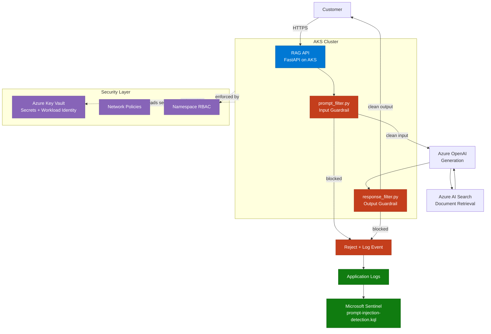

# Architecture Overview — AI Application Security & DevSecOps Pipeline

## Purpose

This program demonstrates how to take an AI-enabled application from threat model to
running, defended code. It picks up a system that was deliberately left as a design-only
artifact in a companion repository and builds it for real: a RAG-based customer service
assistant, hosted on AKS, with input/output guardrails, a security-gated CI/CD pipeline,
and a detection rule built against its own logs.

Where the companion governance program answers *"what controls should exist around this
AI system?"*, this program answers *"how do you actually build and ship the thing those
controls are protecting — securely, with evidence at every layer?"*

## Relationship to existing work

This is the third in a series of three connected programs:

| Repo | Focus | This program's relationship to it |
|---|---|---|
| [`erp-identity-security-reference-architecture`](https://github.com/jonarm/erp-identity-security-reference-architecture) | Identity security for a SaaS ERP (Entra ID, Sentinel, Conditional Access) | Shares the AKS/Terraform/Sentinel deployment pattern and PowerShell/Azure CLI tooling |
| [`ai-security-llm-governance-controls`](https://github.com/jonarm/ai-security-llm-governance-controls) | AI governance and policy for Contoso Retail Group (Entra, Purview, Sentinel, framework mapping) | The RAG Customer Service Assistant threat model and guardrail design in that repo are explicitly scoped as "design only — not running code." **This program builds and secures that system.** |
| `ai-appsec-devsecops-pipeline` (this repo) | Application security and DevSecOps for an AI-powered service | Closes the gap between AI governance theory and a deployed, defended application |

This program does not re-litigate identity governance or AI use-case tiering — those are
covered in the other two repos and referenced here, not duplicated.

## Scenario recap

**Contoso Retail Group** operates a customer-facing RAG assistant that answers product,
order status, and policy questions by retrieving from a document store and generating a
response via an LLM. It is a public-facing input surface that touches customer PII and
order history, which makes it the highest-value target for prompt injection, sensitive
data disclosure, and model abuse — see
[`docs/threat-model-rag-service.md`](./threat-model-rag-service.md) for the full STRIDE
and OWASP LLM Top 10 analysis.

## System components

### 1. RAG API service
A FastAPI application exposing a single `/chat` endpoint. Retrieves grounding context
from a document store and generates a response via Azure OpenAI. This is the system
under test for every other component in this repo — the guardrails, the K8s policies,
the CI/CD gates, and the detection rule all exist to protect this one service.

### 2. Input guardrail — `prompt_filter.py`
Runs before any user input reaches the model. Checks for prompt injection patterns,
enforces input length/structure limits, and rejects requests that attempt to override
system instructions. Documented with real test cases — both injection attempts that are
caught and ones that are deliberately left as known limitations (no guardrail is
complete, and pretending otherwise undermines the rest of the program).

### 3. Output guardrail — `response_filter.py`
Runs on model output before it reaches the customer. Checks for leaked system prompt
content, PII patterns that shouldn't appear in a product/order-status answer, and
unexpected tool-call or instruction-like content in the response (a secondary defence
against the model being manipulated into echoing instructions back).

### 4. Hosting — Azure Kubernetes Service (AKS)
The RAG API runs as a containerised workload on AKS, with namespace-level network
policies, least-privilege RBAC, restricted Pod Security Standards, and secrets sourced
from Azure Key Vault via Workload Identity — not environment variables or in-cluster
secrets.

### 5. CI/CD security gates — GitHub Actions
Every commit passes through CodeQL (SAST), Gitleaks (secret scanning), Trivy (container
image scanning), and Checkov (Terraform/IaC scanning) before a build is eligible for
deployment. Findings are evidence, not just green checkmarks — see each workflow's
deployment notes for what was actually caught and fixed during the build.

### 6. Detection — Microsoft Sentinel
One KQL analytics rule for prompt injection attempt detection, built against real
application logs emitted by the guardrails above — not a generic template. This is the
same detection category that the governance repo's `sentinel/README.md` documents as
blocked by a licensing/connector limitation in that environment; this program builds the
application-side logging needed to make that detection real.

## Architecture diagram

## Data flow and trust boundaries

| Boundary | Crossing point | Control |
|---|---|---|
| Internet → AKS ingress | Customer request to RAG API | TLS termination, rate limiting (documented in `kubernetes/`) |
| RAG API → Input guardrail | Raw user input before model call | `prompt_filter.py` — first trust boundary, untrusted input |
| RAG API → Azure OpenAI | Model invocation | Workload Identity, no embedded API keys |
| Azure OpenAI → Output guardrail | Generated response before customer delivery | `response_filter.py` — second trust boundary, untrusted model output |
| AKS → Azure Key Vault | Secret retrieval | Workload Identity Federation, no static credentials in cluster |
| Application → Sentinel | Log ingestion | Diagnostic settings / Log Analytics workspace |

The two guardrails are the program's primary trust boundaries: user input is treated as
untrusted on the way in, and model output is treated as untrusted on the way out — the
model itself is not a trusted intermediary in either direction.

## Design principles

- **Guardrails are code, not policy documents.** Every control in this repo that claims
  to mitigate a threat-model risk has a corresponding test case showing it firing.
- **Defence is layered, not single-point.** Network policy, RBAC, Workload Identity, and
  application-level guardrails all assume the others can fail.
- **Evidence over architecture diagrams.** Every component this program claims is "live"
  is backed by a deployment note describing what was actually configured, what broke, and
  how it was fixed — following the same evidence standard as the other two repos in this
  series.
- **Known limitations are documented, not hidden.** Guardrails that don't catch every
  injection variant are recorded as known gaps with reasoning, not silently omitted.

## Scope boundaries — what this program does and does not cover

| In scope | Out of scope (see companion repos) |
|---|---|
| RAG API application security | AI use-case risk tiering and governance (→ governance repo) |
| Prompt injection / output validation guardrails | Tenant-wide Copilot identity controls (→ ERP / governance repos) |
| AKS workload security (RBAC, NetworkPolicy, Pod Security, Workload Identity) | Broader Entra Conditional Access design (→ governance repo) |
| CI/CD security gates (SAST, secrets, container, IaC scanning) | Multi-service event-driven architecture, Kafka, API Gateway |
| One detection rule built against real application logs | Full SOC detection coverage across multiple AI systems |

This program is intentionally a single, deep slice — one AI service, secured end to end
— rather than a broad platform. The full-platform version of this idea (multiple
microservices, event streaming, multi-framework compliance mapping) was scoped and
deliberately cut down to keep evidence quality high and the build finishable.

## Technology stack

- **Application**: Python, FastAPI
- **AI platform**: Azure OpenAI Service, Azure AI Search (retrieval)
- **Hosting**: Azure Kubernetes Service (AKS)
- **Secrets**: Azure Key Vault, Workload Identity Federation
- **CI/CD**: GitHub Actions (CodeQL, Gitleaks, Trivy, Checkov)
- **IaC**: Terraform
- **Detection**: Microsoft Sentinel, KQL